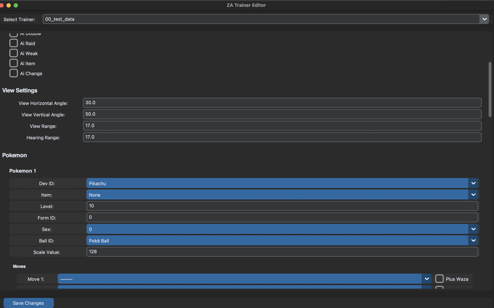

# SkyPy

Trainer editor for Pokemon Legends ZA.

## Usage

  

Edit as you want, then `Save`. It will create a folder with the output `.json` file. This file now needs to be converted to binary (`.bin`). This is not supported yet, you'll have to do it yourself.

> This will happen automatically in the future.

Once you have the binary file, that's your mod. Make sure it is at `mod/romfs/world/ik_data/trainer/trdata/trdata_array.bin`.

## Installation from source

> Coming soon...
